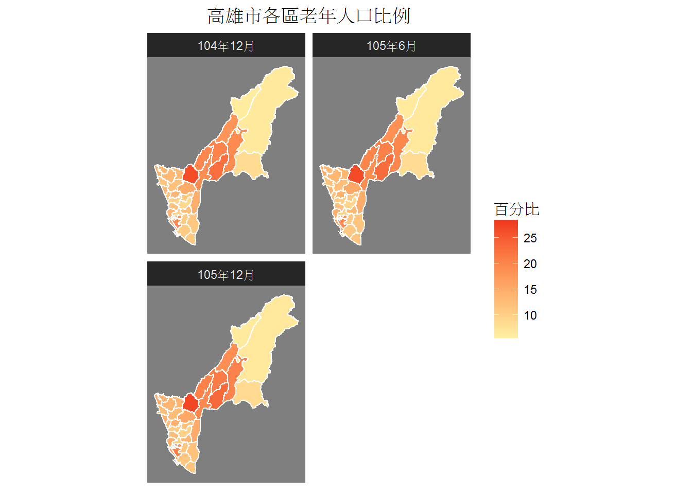
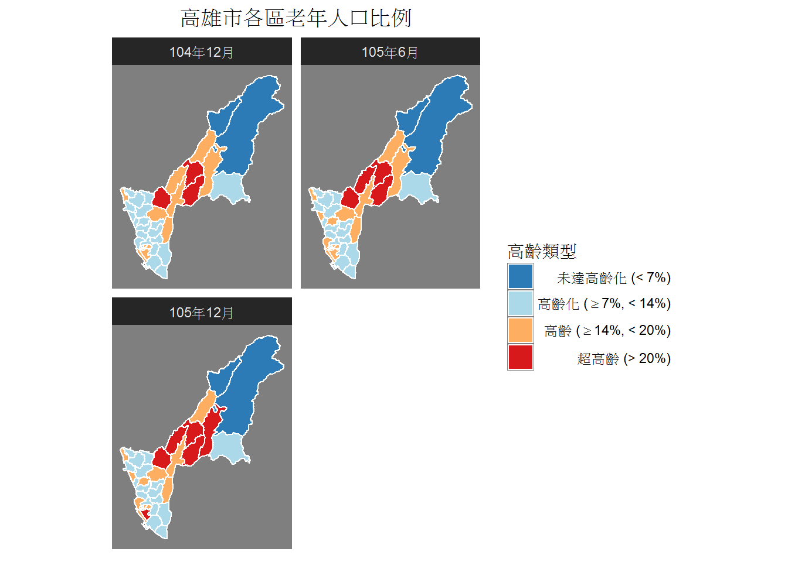

# Old Population Proportions
## Shiny app showing proportions of older adults across districts in Taiwan.
__This document is introduing how [my Shiny app](https://corytu.shinyapps.io/old_populations_dist/) (in Mandarin) presents the proportions of aged people across all 368 districts in Taiwan. Different counties and cities are isolated. The data were collected every six months from December 2015.__<br>
_The figure titles and legends below will be presented in Mandarin._<br>
The district border information is accessed from http://data.gov.tw/node/7441:
* 內政部國土測繪中心 [2015] [鄉（鎮、市、區）界線（TWD97經緯度）]
* The Open Data is made available to the public under the Open Government Data License. User can make use of it when complying to the condition and obligation of its terms.
* Open Government Data License: http://data.gov.tw/license

### Data preprocesing
```r
library(maptools)
library(ggplot2)
library(mapproj)
library(magrittr)
library(reshape2)
mymap <- readShapePoly("old_populations_dist/data/mapdata201701120616/DistrictBorder1051214/TOWN_MOI_1051214.shp")
# Read the borders from .shp file
CountyTown <- paste(iconv(mymap$COUNTYNAME, from = "UTF-8"),
                    iconv(mymap$TOWNNAME, from = "UTF-8"), sep = "")
# Paste county names and town names
mymap2 <- fortify(mymap) %>%
  transform(id = factor(id, labels = CountyTown))
# Coerce the data into a data frame
raw_data <- read.csv("old_populations_dist/data/OldRate.csv")
# Input old population rates (pure numbers)
source("old_populations_dist/data/HOPE.R", encoding = "UTF-8")
raw_data$CountyTown <- hope
# HOPE.R has previously saved "countytown" names which is encoded in UTF-8
# This configuration is for the Shiny app to deal with Chinese characters
merged_data <- merge(data.frame(CountyTown = CountyTown), raw_data)
names(merged_data)[1] <- "id"
merged_data <- transform(merged_data, id = factor(id, levels = levels(mymap2$id))) %>%
  melt(id.vars = "id") %>%
  transform(variable = factor(variable, labels = c("104年12月", "105年6月", "105年12月")))
# Prepare the date labels for faceting later
merged_data$aged <- sapply(1:nrow(merged_data),
                           function(i){
                             if (merged_data$value[i] < 7) {"未達高齡化"}
                             else if (merged_data$value[i] < 14) {"高齡化"}
                             else if (merged_data$value[i] < 20) {"高齡"}
                             else {"超高齡"}
                           })
merged_data <- transform(merged_data, aged = factor(aged,levels = c("未達高齡化", "高齡化", "高齡", "超高齡")))
# Categorize the seriousness of aging status
# names(mymap2)[1:2] <- c("x", "y")
```

### Completed the data cleaning, and it's time to plot!
Note: I found that the shp file somehow is problematic when plotting all districts in Taiwan at once. The geographical information is totally messed up. However showing districts of only one county or city at a time works great. Here I will demonstrate the code for Kaohsiung City.

```r
wanted_city <- "高雄市"
city_map <- mymap[grep(wanted_city, iconv(mymap$COUNTYNAME, from = "UTF-8")),]
city_map2 <- fortify(city_map)
ids <- unique(as.numeric(city_map2$id))
city_map2 <- transform(city_map2, id = factor(id, labels = CountyTown[ids+1]))
city_data <- merged_data[grep(wanted_city, merged_data$id),]
```

Following lines are using the ggplot2 package in R to illustrate the result.

```r
g <- ggplot(data = city_data)
g <- g + geom_map(map = city_map2, aes(map_id = id, fill = value), color = "white") +
  expand_limits(x = range(city_map2$long), y = range(city_map2$lat)) +
  coord_map()
# Somehow "x and y" and "long and lat" work differently and need different expand_limits settings
# Correct coordinates when projecting the global map onto flat 2D space
g <- g + scale_fill_gradient(limits = c(6, 28), low = "#ffeda0", high = "#f03b20")
# limits = range(merged_data$value)
# Uniformize the scale of colors so that counties are comparable
g <- g + labs(list(fill = "百分比"))
g <- g + theme_dark() +
  facet_wrap(~ variable, ncol = 2) +
  labs(list(title = paste(wanted_city, "各區老年人口比例", sep = "")))
g <- g + theme(axis.title = element_blank(),
               axis.text = element_blank(),
               axis.line = element_blank(),
               axis.ticks = element_blank(),
               panel.grid = element_blank(),
               plot.title = element_text(hjust = 0.5))
g
```



__The redder the district, the more aged people there (in percentage).__ The continuous scale provides information of different districts in fine resolution. Data of three time points (Dec 2015, Jun 2016, and Dec 2016) are shown. However the increase of aged people in Taiwan may not be obvious enough, so I plot another figure by categories of seriousness (not aging, aging, aged, and super-aged).

```r
color_values <- c("#2c7bb6", "#abd9e9", "#fdae61", "#d7191c")
label_values <- c("未達高齡化 (< 7%)",
                  expression("高齡化 (">= "7%, < 14%)"),
                  expression("高齡 (">= "14%, < 20%)"),
                  "超高齡 (> 20%)")
# Prepared for matching according the sub-datasets later
MatchedIndex <- sort(match(unique(city_data$aged), levels(merged_data$aged)))
# I have to sort the index or otherwise the orders of matched indexes will be the same as unique(subcounty_data$aged)
# Example: match(unique(c(3,3,2,5,1,2,2,4)), 1:10)
h <- ggplot(data = city_data)
h <- h + geom_map(map = city_map2, aes(map_id = id, fill = aged), color = "white") +
  expand_limits(x = range(city_map2$long), y = range(city_map2$lat)) +
  coord_map()
h <- h + scale_fill_manual(values = color_values[MatchedIndex],
                           labels = label_values[MatchedIndex])
# Note: It's NOT scale_fill_discrete when assigning colors
h <- h + labs(list(fill = "高齡類型"))
h <- h + theme_dark() +
  facet_wrap(~ variable, ncol = 2) +
  labs(list(title = paste(wanted_city, "各區老年人口比例", sep = "")))
h <- h + theme(axis.title = element_blank(),
               axis.text = element_blank(),
               axis.line = element_blank(),
               axis.ticks = element_blank(),
               panel.grid = element_blank(),
               plot.title = element_text(hjust = 0.5))
h
```



__Again, the redder the district, the higher proportions of aged people there.__ Kaohsiung City has districts which are quite young (but in fact also few people), but some really old ones too.

### Remarks
We can find that from 2015 to 2016, the status of multiple districts have shifted from aging to aged or even super-aged. The problems of aging society are very likely to become more explicit in Taiwan in the near future. We should be prepared when that comes.

[html version](https://corytu.github.io/R-Language-Playground/Old_Population_Proportions.html)
